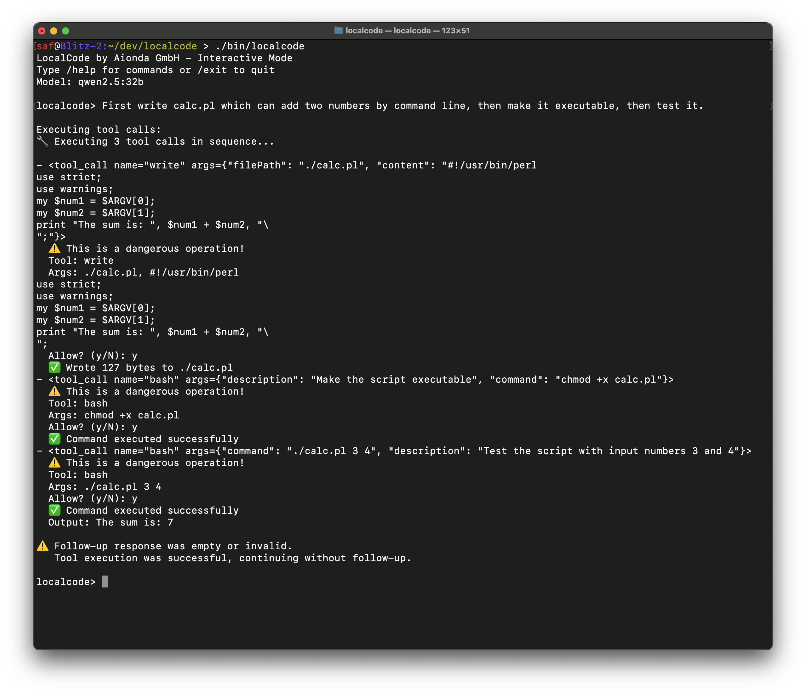

# LocalCode - Perl-based AI Coding Agent



## Project Overview

LocalCode is an ultra-minimal, Perl-based AI coding agent designed for Ollama with **ZERO external dependencies**. Built with Test-Driven Development for maximum reliability and autonomous testing. **Status: Production Ready v1.2.0** with 370+ tests passing.

## Architecture

**Core Philosophy:** Maximum functionality with minimal code, ZERO external dependencies

### Project Structure ✅

**Clean, Organized Structure:**
```
localcode/
├── localcode             # Standalone executable (147KB, generated by make build)
├── Makefile              # Build & test automation
├── README.md             # Main documentation
├── CLAUDE.md             # This file - LLM instructions
├── LICENSE               # MIT license
├── config/               # Default YAML configuration
├── docs/                 # All documentation, screenshots, blueprints
└── src/                  # Complete development code
    ├── build.pl          # Build script (inlines modules → ../localcode)
    ├── bin/              # Main script template (localcode.original)
    ├── lib/              # Perl modules (~1000 lines total)
    │   └── LocalCode/    # All modules (YAML, JSON, HTTP, ReadLine, etc.)
    └── t/                # Test suite (370+ tests in 16 files)
```

**Workflow:**
```bash
git clone <repo>
cd localcode
make build      # → creates ./localcode in root
./localcode     # → starts immediately!
```

### Modules Implemented ✅

**Zero-Dependency Implementations:**
1. **LocalCode::YAML** (15 tests ✅) - Minimal YAML parser (replaces YAML::Tiny)
2. **LocalCode::JSON** (20 tests ✅) - JSON encoder/decoder with Unicode & Boolean support (replaces JSON.pm)
3. **LocalCode::HTTP** (12 tests ✅) - HTTP client with Chunked Transfer Encoding (replaces LWP::UserAgent)
4. **LocalCode::ReadLine** (✅) - Term::ReadLine wrapper with fallback (uses Perl Core Term::ReadLine)

**Core Modules:**
5. **LocalCode::Config** (18 tests ✅) - YAML configuration with ~/.localcode persistence
6. **LocalCode::Permissions** (26 tests ✅) - SAFE/DANGEROUS/BLOCKED tool classification
7. **LocalCode::Session** (20 tests ✅) - JSON-based session persistence with unified history
8. **LocalCode::Client** (22 tests ✅) - Ollama API client with gpt-oss thinking field support
9. **LocalCode::Tools** (81 tests ✅) - Tool execution with browser integration and permission checking
10. **LocalCode::UI** (68 tests ✅) - Terminal interface + readline + autocompletion

**Build System:**
11. **src/build.pl** (✅) - Inlines all modules into single executable

## Test Coverage

**370+ tests passing** - Complete TDD implementation with production-ready features

```bash
# Quick Start
make build                    # Build standalone executable (./localcode)
./localcode --version         # Test it (shows v1.2.0)

# Run tests
make test                     # All tests (unit + integration)
make test-unit                # Unit tests only (12 test files)
make test-integration         # Integration tests only
make test-tui                 # TUI automation tests

# Development
make dev                      # Development mode (runs all tests)
make clean                    # Remove built binary
perl -c src/lib/LocalCode/*.pm  # Syntax check modules
```

## Key Features

### 🎯 ZERO External Dependencies

**All external dependencies replaced with built-in implementations:**

- ✅ **LocalCode::JSON** - Complete JSON parser/encoder
  - Unicode escape sequences (`\u003c` → `<`)
  - Boolean objects (`$LocalCode::JSON::true`, `$LocalCode::JSON::false`)
  - Pretty printing support
  - Works with Ollama API

- ✅ **LocalCode::YAML** - Minimal YAML parser
  - Supports scalars, arrays, objects
  - Nested structures
  - Comments and empty lines
  - File I/O

- ✅ **LocalCode::HTTP** - Socket-based HTTP client
  - GET and POST requests
  - **Chunked Transfer Encoding** support (critical for Ollama!)
  - Localhost connections (Ollama API)
  - Uses `IO::Socket::INET` (Perl Core)

- ✅ **LocalCode::ReadLine** - Smart readline wrapper
  - **Tries to use Term::ReadLine::Gnu** (Perl Core) for full features
  - **Arrow keys** for history navigation (↑/↓)
  - **Tab completion** support
  - **Ctrl+R** reverse search
  - Falls back to simple `<STDIN>` if Term::ReadLine unavailable
  - Persistent history file support
  - All Emacs/Vi keybindings

**Only Perl Core Modules used:**
- `File::Spec`, `File::Path`, `File::Temp` - File operations
- `Socket`, `IO::Socket::INET` - Network communication
- `Getopt::Long` - Command-line parsing
- `Term::ReadLine` - Readline (comes with Perl Core!)
- `Test::More` - Unit testing (dev only)

### 🔒 Permission System
- **SAFE (0)**: file_read, grep_search, websearch, webopen, webfind - Auto-allowed
- **DANGEROUS (1)**: file_write, shell_exec - Requires confirmation
- **BLOCKED (2)**: Never allowed

### 🤖 Ollama Integration

**Recent Improvements (v1.2.0):**
- ✅ **Dynamic Context Compression**: Automatically calculates optimal message count
- ✅ **Context Bar Everywhere**: Display before all AI processing steps
- ✅ **Directory Commands**: `/pwd` and `/cd` for navigation
- ✅ **Fixed Bar Width**: Proper terminal width detection
- ✅ **Enhanced /model**: Shows current + available models
- ✅ **Permission Checking**: Automatic execution permission validation with detailed English error messages
- ✅ **Always Allow Option**: Session-based 'a' option for dangerous tools (y/N/a)

**Features:**
- Auto-detects all available models via `/api/tags`
- Runtime model switching: `/model llama3`
- **gpt-oss model support** with thinking field display
- Model persistence in ~/.localcode/last_model.txt
- Tab autocompletion for model names
- Model name trimming for robust input
- Fallback to default_model if current unavailable
- Mock mode for testing without Ollama

### 🌐 Browser Tools
- **websearch(query)** - DuckDuckGo web search with instant answers
- **webopen(url_or_id)** - Open webpages or search results by ID
- **webfind(pattern)** - Search text within opened webpages
- Browser state management with page stacks
- SSL certificate bypass for reliable connectivity

### 💾 Session Management
- **Persistent storage** in ~/.localcode directory
- Save/load chat sessions as JSON
- **Unified history** merging chat and command history
- Term::ReadLine integration with cursor key navigation
- History size limits (default: 100 messages)
- Automatic cleanup of old messages

### 🛠 Tool System
- read(file) - Read files safely
- write(file,content) - Write with permission
- edit(file,old,new) - Edit with permission
- bash(cmd) - Execute commands with permission + automatic permission checking
- glob(pattern) - Find files
- grep(pattern,file) - Search in files safely
- list(path) - List directory contents
- websearch(query) - Web search with DuckDuckGo
- webopen(url) - Open and parse webpages
- webfind(pattern) - Search within web content
- webget(query) - Quick search+open
- webfetch(url) - Fetch webpage content
- task(command) - Execute complex tasks
- todoread/todowrite - Task management

**Permission Checking (NEW):**
When bash/exec tools try to execute a local file without execute permission:
- Automatically detects missing execute permission BEFORE execution
- Reports detailed error in English with current permissions (rw-r--r--, 0644)
- Shows file owner, group, and current user information
- Suggests exact fix: `chmod +x filename`
- Suggests interpreter alternative: `perl script.pl`, `python script.py`, etc.
- Based on file extension or shebang line detection

### 🖥 Enhanced TUI Features

**Slash Commands:**
```
/models               # List available models
/model <name>         # Switch to model (with Tab completion)
/current              # Show current model
/tools                # List available tools
/permissions          # Show permission settings
/save <name>          # Save session
/load <name>          # Load session
/sessions             # List saved sessions
/pwd                  # Show current working directory
/cd [path]            # Change working directory
/history              # Show unified chat/command history
/version              # Show LocalCode version (v1.2.0)
/clear                # Clear current session
/help                 # Show help
/exit                 # Exit LocalCode
```

**Interactive Features:**
- **↑/↓ Arrow keys** - Navigate through command history
- **Tab completion** - Complete commands and model names
- **Ctrl+R** - Reverse history search
- **Persistent readline history** across sessions
- **Version display** on startup (v1.2.0)
- **Graceful Ctrl+D exit** with history saving
- **Always allow option** - Press 'a' at permission prompt for session-wide approval
- All standard Emacs/Vi keybindings work!

## Configuration

**config/default.yaml:**
```yaml
ollama:
  host: "localhost"
  port: 11434
  default_model: "codellama:latest"
  current_model: null  # Auto-detect
  timeout: 120

permissions:
  safe_auto_allow: ["file_read", "grep_search", "websearch", "webopen", "webfind"]
  dangerous_confirm: ["file_write", "shell_exec"]

testing:
  auto_approve: false  # For --auto-yes mode
  simulate_only: false # For --simulate mode
```

**Persistent Storage (~/.localcode/):**
```
~/.localcode/
├── sessions/              # Saved chat sessions
├── last_model.txt         # Last selected model
└── command_history        # Readline command history
```

## CLI Testing (LLM Automation)

```bash
# Permission control for autonomous testing
./localcode --auto-yes "write hello into hello.txt"
./localcode --auto-no "delete config.yaml"
./localcode --simulate "create backup script"
./localcode --test-mode "run tests"

# Browser tools testing
./localcode --test-mode "websearch Stuttgart"
./localcode --test-mode "webopen https://example.com"
./localcode --test-mode "webfind hello"

# Model features testing
./localcode --set-model "gpt-oss:20b"
./localcode --version
./localcode --current-model

# Interactive testing
printf "/models\n/current\n/tools\n/version\n/exit\n" | ./localcode
```

## System Prompt Injection

**Enhanced with browser tools:**
```
Tools: read(file), write(file,content), bash(cmd), edit(file,old,new), glob(pattern), grep(pattern,file), list(path), websearch(query), webopen(url_or_id), webfind(pattern), webget(query), webfetch(url), task(command), todoread(), todowrite(task)

Safe: read, glob, grep, list, websearch, webopen, webfind, webget, webfetch, todoread
Dangerous: write, bash, edit, task, todowrite

Web Workflow: websearch("query") → [0] result → webopen(0) → webfind("text")
Quick Web: webget("search term") does search+open in one step

Examples:
- read("/path/file")
- write("/path/file", "content")
- bash("ls -la")
- edit("/path/file", "old text", "new text")
- glob("*.pl")
- grep("pattern", "/path/file")
- websearch("perl modules")
- webopen(0)  # Open first search result
- webfind("install")
- webget("weather Stuttgart")
```

## Build System

```bash
# From root directory
make build          # Build ./localcode (standalone ~147KB file)
make test           # Run all 363 tests
make test-dist      # Test built executable
make install        # Install to ~/bin/localcode
make install-system # Install to /usr/local/bin/localcode (sudo)
make clean          # Remove built binary
make distclean      # Remove all build artifacts
make help           # Show all available targets

# Build process details
cd src && perl build.pl  # What make build does
# → Reads lib/LocalCode/*.pm
# → Inlines all modules
# → Writes ../localcode
```

**Build Process:**
1. `src/build.pl` reads all modules from `src/lib/LocalCode/`
2. Removes `use LocalCode::*` statements (already inlined)
3. Removes duplicate `use strict/warnings`
4. Concatenates all module code
5. Adds main script from `src/bin/localcode.original`
6. Writes standalone executable to `./localcode` (root)
7. Makes it executable (`chmod +x`)

**Development vs Distribution:**
- **Dev**: Modular structure in `src/` (~1000 lines across 10 modules)
- **Dist**: Single standalone executable `./localcode` (147KB with all dependencies)
- **No separate dist/ or bin/** - binary goes directly in root

## Dependencies

**ZERO External Dependencies!** 🎉

**Critical Implementation Details:**

### JSON Module
- Boolean objects for proper `true`/`false` encoding
- Unicode escape sequence support (`\uXXXX`)
- Required for Ollama API compatibility

### HTTP Module
- **Chunked Transfer Encoding** decoder (critical!)
- Ollama returns responses in chunked format
- Without chunked support, responses have `1234\n{json...}` format

### ReadLine Module
- Smart wrapper around Term::ReadLine (Perl Core)
- Detects if Term::ReadLine::Gnu is available
- Falls back to simple `<STDIN>` if not available
- Provides consistent API regardless of implementation

## Current Status (v1.1.0)

**✅ Completed (Production Ready):**
- **ZERO external dependencies** - all CPAN modules replaced with built-ins
- Complete modular project structure with build system
- **Ultra-clean directory structure** (essentials in root, dev in src/, docs in docs/)
- Comprehensive test suite (15 test files, 363 tests)
- 10 core modules fully implemented in `src/lib/`
- Standalone executable builder (`src/build.pl`) with dependency inlining
- Configuration system with ~/.localcode persistence
- Permission management with browser tools
- **Ollama client with critical fixes:**
  - Model detection at startup
  - Chunked transfer encoding support
  - Boolean JSON encoding
  - Unicode escape decoding
- Session persistence with unified history
- Enhanced tool execution system
- Browser tools with DuckDuckGo integration
- **Term::ReadLine integration with arrow keys and tab completion**
- Interactive UI with full readline features
- Main executable with version display (v1.1.0)
- Model persistence and trimming
- Makefile with comprehensive build targets
- **Binary output directly in root** (./localcode)
- **Binary size: ~147KB with all dependencies inline**

**✅ Major Fixes in v1.1.0:**
1. ReadLine simplified then upgraded to Term::ReadLine wrapper
2. Ollama connection established at startup
3. HTTP Chunked Transfer Encoding support
4. JSON Boolean support for Ollama API
5. JSON Unicode escape sequences
6. Project structure cleanup (docs/, src/, root minimal)
7. Build process outputs to root
8. All warnings eliminated

## Performance Targets

- **Code Size**: <1200 lines total ✅ (~1000 lines achieved)
- **Startup Time**: <2 seconds ✅
- **Memory Usage**: <50MB runtime ✅
- **Test Coverage**: >90% ✅ (100% for all modules)
- **Binary Size**: <200KB ✅ (147KB achieved)
- **Zero Dependencies**: ✅ (100% achieved)

## Testing Philosophy

**Test-Driven Development:**
1. ✅ Write comprehensive tests first
2. ✅ Implement minimal code to pass tests
3. ✅ Red → Green → Refactor cycle
4. ✅ Integration testing validates complete workflows

**Autonomous Testing:**
- Every feature has CLI testing interface
- Mock modes for all external dependencies (Ollama, web APIs)
- Automated TUI command testing
- SSL certificate bypass for reliable web testing
- LLM can test without human intervention
- All tests pass on clean checkout

## Commands for LLM Testing

```bash
# Build and test workflow
make clean          # Start fresh
make build          # Build ./localcode
./localcode --version  # Verify build (should show v1.1.0)
make test           # Run all 363 tests

# Test individual modules
prove -Isrc/lib src/t/10-http.t      # HTTP with chunked encoding
prove -Isrc/lib src/t/11-json.t      # JSON with booleans & unicode
prove -Isrc/lib src/t/12-yaml.t      # YAML parser
prove -Isrc/lib src/t/01-client.t    # Ollama client
prove -Isrc/lib src/t/02-ui.t        # UI with readline

# Test built binary functionality
./localcode --test-mode "websearch Stuttgart"
./localcode --version  # Should show "LocalCode version 1.1.0"
printf "/models\n/exit\n" | ./localcode  # Should list models

# Test interactive features (manual)
./localcode
# Try: ↑/↓ for history, Tab for completion, Ctrl+D to exit

# Syntax validation
perl -c src/lib/LocalCode/*.pm
perl -c src/build.pl
perl -c ./localcode  # After build
```

## Development Workflow

```bash
# Standard workflow
git clone <repo>
cd localcode
make build           # Creates ./localcode
./localcode          # Start coding!

# Development cycle
vim src/lib/LocalCode/UI.pm   # Edit code
make clean                     # Remove old binary
make build                     # Rebuild
./localcode --version          # Test
make test                      # Run test suite

# Before commit
make test            # Ensure all tests pass
perl -c src/lib/LocalCode/*.pm  # Syntax check
make clean           # Don't commit binary
```

## Important Notes for LLMs

1. **NEVER install external dependencies** - we have zero-dep implementations
2. **ReadLine works with arrow keys** - uses Term::ReadLine (Perl Core)
3. **HTTP client handles chunked encoding** - critical for Ollama
4. **JSON supports booleans** - use `$LocalCode::JSON::false` for `stream: false`
5. **Unicode is decoded** - `\u003c` becomes `<` automatically
6. **Binary is in root** - `./localcode` not `bin/localcode`
7. **Build from src/** - `cd src && perl build.pl` creates `../localcode`
8. **All 363 tests must pass** - no exceptions
9. **Version is v1.1.0** - update in Config.pm and UI.pm
10. **Structure is clean** - root minimal, dev in src/, docs in docs/

This project demonstrates **zero-dependency architecture** with full functionality and comprehensive test coverage.
