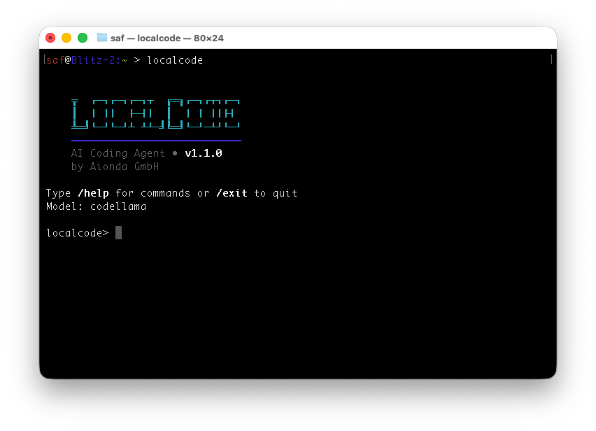

# LocalCode

A compact, Perl-based AI coding agent with browser tools and gpt-oss support that provides an interactive terminal interface for AI-assisted programming tasks using local Ollama models.



*LocalCode v1.2.0 - Zero dependencies, full-featured AI coding agent with interactive terminal UI.*


*LocalCode executing multiple tool calls in sequence: creating a Perl calculator, making it executable, and testing it - all from a single AI prompt.*


*Using the open-source GPT-OSS:120b model from OpenAI, LocalCode can create sophisticated web applications locally. This example shows the AI creating a complete calculator web app with HTML, CSS, and JavaScript from a single prompt "Create a calculator as web app."*

## Features

### Core Features
- **Local AI Models**: Works with Ollama including codellama and gpt-oss models with thinking field support
- **Interactive Terminal UI**: Command-line interface with readline, cursor key navigation, and TAB completion
- **Context Tracking**: Real-time display of token usage with color-coded warnings (green <70%, yellow 70-89%, red ≥90%)
- **Smart Context Compression**: AI-powered conversation summarization at 90% usage preserves context while reducing tokens
- **Dynamic Compression**: Automatically calculates how many messages to compress based on context usage
- **Auto-Context Management**: Intelligent compression with fallback to truncation if summarization fails
- **Multiple Tool Execution**: AI can execute multiple tools in sequence for complete workflows
- **Intelligent Follow-up**: AI analyzes tool results and automatically executes additional tool calls
- **Tool Execution**: Secure permission-based system for running AI-requested tools

### Browser Integration
- **Web Search**: DuckDuckGo integration with `websearch(query)` tool  
- **Web Navigation**: Open webpages with `webopen(url_or_id)` tool
- **Content Search**: Find text within webpages using `webfind(pattern)` tool
- **Quick Web Access**: Combined search+open with `webget(query)` tool
- **SSL Bypass**: Reliable web connectivity with certificate bypass

### Enhanced Session Management
- **Persistent Storage**: All data stored in ~/.localcode directory
- **Model Persistence**: Last selected model saved and restored on restart
- **Unified History**: Chat conversation and command history merged
- **Command History**: Cursor key navigation with Term::ReadLine persistence

### Advanced Tool System
- **18 Built-in Tools**: Including browser tools (websearch, webopen, webfind, webget)
- **Smart Tool Parsing**: Robust XML parser with validation for required arguments
- **Follow-up Execution**: Tool calls in AI follow-up responses are automatically parsed and executed
- **Smart Autocompletion**: Tab completion for commands and model names with trimming
- **Enhanced gpt-oss Support**: Optimized prompting and response handling for thinking field models
- **Execution Permission Checking**: Automatic validation before running scripts with detailed error messages
- **Always Allow Option**: Session-based permission approval with 'a' option (y/N/a)

### Technical Excellence
- **Test-Driven Development**: 370+ comprehensive tests ensuring reliability
- **Zero Dependencies**: Pure Perl with only core modules - no external CPAN dependencies
- **Smart Context Management**: AI-powered compression at 90%, with proactive monitoring and reactive fallback
- **Context Compression**: Automatically summarizes old conversations to preserve context while reducing token usage
- **Visual Context Bar**: Integrated status bar showing `───[ Context: 18% (770/4096) ]` before each prompt
- **Robust Error Handling**: AI can analyze tool failures and suggest fixes automatically
- **Permission Checking**: Automatic execution permission validation with detailed error reporting in English

## Requirements

**ZERO External Dependencies!**

- Perl 5.10+ (with core modules only)
- Ollama running locally (codellama, llama2, gpt-oss, or other models)

All required functionality is built-in:
- ✅ JSON parser/encoder
- ✅ YAML config reader
- ✅ HTTP client (for Ollama API)
- ✅ Basic readline with history
- ✅ URL encoding

Only uses Perl core modules: `File::Spec`, `File::Path`, `Socket`, `IO::Socket::INET`, `Getopt::Long`

## Installation

### Quick Install (Recommended)

1. Clone the repository:
```bash
git clone <repository-url>
cd localcode
```

2. Build and run (no dependencies to install!):
```bash
make build
./localcode --version
```

The project uses a modular development structure that builds into a single standalone executable:
- `src/` contains development code (modules, tests, build script)
- `src/build.pl` creates a single-file executable
- `localcode` is the ready-to-use standalone binary in the root directory

3. (Optional) Install to your ~/bin:
```bash
make install
export PATH=$PATH:$HOME/bin
```

4. Ensure Ollama is running:
```bash
ollama serve
```

### Development Structure

The project separates development and distribution:
```
localcode/
├── localcode            # Standalone executable (built by 'make build', git-ignored)
├── Makefile             # Build system
├── README.md            # This documentation
├── CLAUDE.md            # Developer documentation
├── LICENSE              # License file
├── config/              # Configuration files
│   └── default.yaml
├── docs/                # Documentation and screenshots
└── src/                 # Development source code
    ├── build.pl         # Build script that inlines all modules
    ├── lib/             # Perl modules (Config, Client, Tools, UI, etc.)
    ├── bin/             # Original script template
    └── t/               # Test suite (363+ tests)
```

After cloning, just run `make build` to create the standalone executable `localcode` in the root directory.

## Usage

### Interactive Mode

Start the interactive terminal:
```bash
localcode  # If installed via make install
# or
./localcode  # If running from source directory
```

### Available Slash Commands

- `/models` - List available Ollama models
- `/model <name>` - Switch to a different model (with Tab completion)
- `/current` - Show current model
- `/tools` - List available tools
- `/permissions` - Show permission settings
- `/save <name>` - Save current session
- `/load <name>` - Load saved session
- `/sessions` - List saved sessions
- `/pwd` - Show current working directory
- `/cd [path]` - Change working directory or show current directory
- `/history` - Show unified chat and command history
- `/version` - Show LocalCode version
- `/clear` - Clear current session
- `/help` - Show help information
- `/exit` - Exit the application

### Enhanced Tool System

LocalCode includes 18 built-in tools that the AI can use:

#### File Operations
- **read** - Read file contents
- **write** - Write content to files (requires permission)
- **edit** - Edit existing files (requires permission)
- **list** - List directory contents
- **glob** - Find files matching patterns
- **patch** - Apply patches to files (requires permission)

#### System Operations
- **bash/exec** - Execute shell commands (requires permission, with automatic permission checking)
- **search/grep** - Search for patterns in files
- **task** - Execute complex multi-step tasks (requires permission)

#### Browser Tools
- **websearch** - Search the web using DuckDuckGo
- **webopen** - Open webpages or search results by ID
- **webfind** - Search for text within opened webpages
- **webget** - Combined search and open in one step
- **webfetch** - Fetch web content directly

#### Productivity Tools
- **todowrite** - Write todo items
- **todoread** - Read todo items

### Permission System

Tools are classified into three categories:
- **SAFE**: Auto-approved (read, grep, list, glob, webfetch, websearch, webopen, webfind, webget, todoread)
- **DANGEROUS**: Requires user approval (bash, write, edit, patch, task, todowrite)
  - Permission prompt: `Allow? (y/N/a)` where 'a' = always allow for this session
- **BLOCKED**: Not allowed (none by default)

**Execution Permission Checking:**
When bash/exec tools attempt to run a local file:
- Automatically checks for execute permission BEFORE execution
- Reports detailed error in English if permission denied:
  - Current file permissions (rw-r--r--, 0644)
  - File owner, group, and current user
  - Exact fix suggestion: `chmod +x filename`
  - Alternative: Run with interpreter (perl, python, bash, etc.)
  - Smart interpreter detection based on file extension or shebang

### CLI Usage

```bash
# Interactive mode
localcode

# Direct commands
localcode "search the web for Perl tutorials"
localcode "read config.yaml and show me the settings"

# Model management
localcode --list-models
localcode --set-model gpt-oss:20b
localcode --current-model

# Version and help
localcode --version
localcode --help

# Testing modes
localcode --auto-yes "write hello to test.txt"
localcode --simulate "dangerous command"
localcode --test-mode "mock execution"
```

## Intelligent AI Workflows

LocalCode's enhanced AI system provides intelligent multi-step execution:

### Follow-up Tool Execution
When tool execution results are returned to the AI, LocalCode automatically:
1. **Analyzes Results**: AI reviews tool outputs, errors, and success status
2. **Intelligent Response**: AI generates follow-up actions based on results  
3. **Automatic Execution**: Tool calls in follow-up responses are parsed and executed
4. **Error Recovery**: AI suggests fixes when tools fail (e.g., missing includes in C programs)

### Example Workflow
```bash
User: "Create a C program that adds two numbers"
AI: Creates add.c with write tool
System: Executes write tool, reports success
AI: Compiles program with gcc
System: Reports compilation error (missing #include <stdlib.h>)
AI: Analyzes error, suggests fix, updates code automatically
System: Executes edit and compile tools
AI: Tests the final program with sample input
```

### gpt-oss Model Support
Special optimizations for OpenAI's open-source GPT-OSS models:
- **Thinking Display**: Shows AI reasoning process during analysis
- **Optimized Prompting**: Clear instructions for tool call placement
- **Enhanced Parsing**: Robust handling of thinking + response structure
- **Context Management**: Efficient conversation flow with thinking content
- **Advanced Applications**: Create sophisticated web apps, full-stack solutions, and complex multi-file projects locally with models like GPT-OSS:120b

## Configuration

Configuration is stored in `config/default.yaml`:

```yaml
ollama:
  host: "localhost"
  port: 11434
  default_model: "codellama:latest"
  current_model: null  # Auto-detect and persist

permissions:
  safe_auto_allow: ["file_read", "grep_search", "websearch", "webopen", "webfind", "webget"]
  dangerous_confirm: ["file_write", "shell_exec"]
  
testing:
  auto_approve: false  # For --auto-yes mode
  simulate_only: false # For --simulate mode
```

### Persistent Storage

LocalCode stores all persistent data in `~/.localcode/`:

```
~/.localcode/
├── sessions/              # Saved chat sessions
├── last_model.txt         # Last selected model
└── command_history        # Readline command history
```

## Testing

Run the comprehensive test suite:
```bash
make test              # All tests
prove -l t/04-config.t # Specific module
make test-verbose      # Detailed output
```

### Advanced Testing
```bash
# Test web search functionality
localcode --test-mode "websearch Stuttgart"
localcode --test-mode "webget current weather Berlin"
localcode --test-mode "webopen https://example.com"
localcode --test-mode "webfind hello"

# Test gpt-oss models with follow-up execution
localcode --set-model "gpt-oss:20b"
localcode --auto-yes "erstelle ein C-Programm das zwei Zahlen addiert"

# Advanced web development with gpt-oss:120b
localcode --set-model "gpt-oss:120b"
localcode --auto-yes "Create a calculator as web app"
localcode --auto-yes "Build a todo list application with local storage"
localcode --auto-yes "Create a responsive landing page with animations"

# Test robust tool parsing
localcode --test-mode "create a complex script with multiple steps"
```

Tests include:
- Unit tests for all modules (316+ tests)
- Browser tools integration tests
- gpt-oss thinking field validation and follow-up execution
- XML tool call parser robustness tests
- Follow-up tool execution validation
- Tool argument validation tests
- Model persistence and trimming tests
- Readline history functionality
- SSL certificate bypass validation
- Permission system tests

## Development

The project follows Test-Driven Development (TDD) methodology with:

- **lib/LocalCode/Config.pm** - YAML configuration with ~/.localcode persistence
- **lib/LocalCode/Permissions.pm** - SAFE/DANGEROUS/BLOCKED tool classification
- **lib/LocalCode/Session.pm** - JSON session persistence with unified history
- **lib/LocalCode/Client.pm** - Ollama API client with gpt-oss thinking field support
- **lib/LocalCode/Tools.pm** - Tool execution system with browser integration
- **lib/LocalCode/UI.pm** - Terminal interface with readline and autocompletion
- **bin/localcode** - Main executable with version display (v1.1.0)

## Architecture

LocalCode is designed to be:
- **Maintainable**: Pure Perl with minimal dependencies
- **Secure**: Permission-based tool execution with SSL bypass for web tools
- **Efficient**: Compact and optimized codebase with zero external dependencies
- **Robust**: Handles complex AI-generated content with embedded quotes and incomplete tool calls
- **Local-First**: Works with local Ollama while providing web search capabilities
- **User-Friendly**: Tab completion, cursor key navigation, persistent history
- **AI-Enhanced**: Optimized gpt-oss support with thinking field display and follow-up execution
- **Intelligent**: AI analyzes tool failures and automatically suggests fixes
- **Extensible**: Easy-to-add new tools while maintaining security model

## License

This project is developed by Aionda GmbH.

## Contributing

1. Follow TDD methodology - write tests first
2. Maintain code style consistency
3. Ensure all tests pass before submitting
4. Keep the codebase compact and focused
