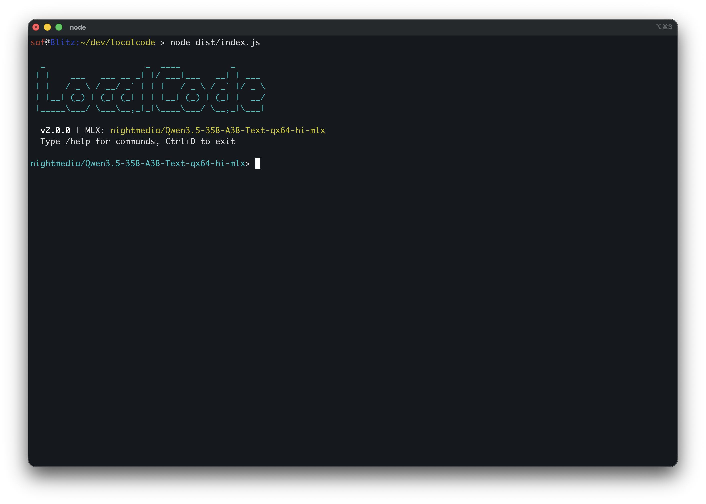
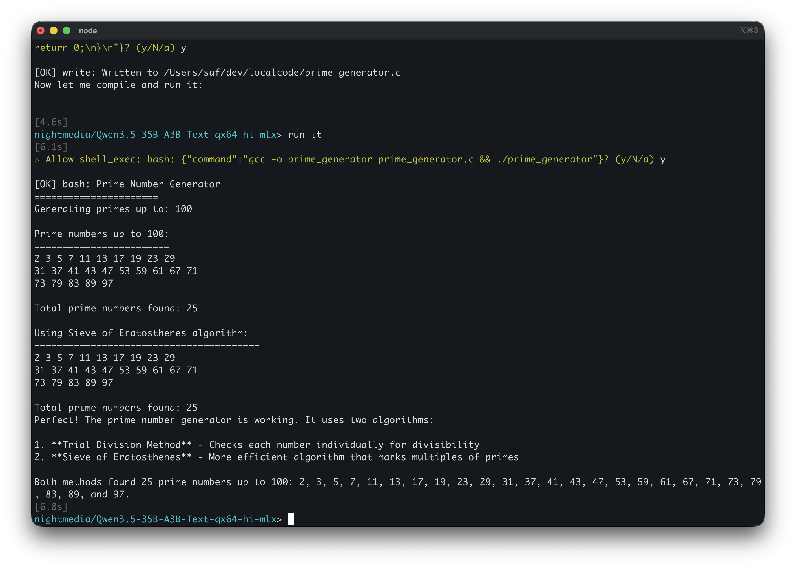

# LocalCode v2.0.0

AI coding agent for local LLMs. Built for macOS with MLX backend support.

LocalCode connects to a local LLM (MLX or Ollama), provides coding tools (file read/write, shell exec, web search), and uses native tool calling to act as a fully autonomous coding assistant — similar to Claude Code, but running entirely on your hardware.





## Features

- **Streaming responses** — live token-by-token output, no waiting
- **Native Qwen3 tool calling** — uses OpenAI-compatible `tools` parameter
- **MLX auto-start** — automatically starts the MLX server if not running
- **MLX auto-restart** — restarts the server on crash/hang during sessions
- **MCP support** — Model Context Protocol for external tool servers
- **LOCALCODE.md & CLAUDE.md** — reads LOCALCODE.md files first, falls back to CLAUDE.md (fully compatible with Claude Code)
- **Permission system** — SAFE/DANGEROUS/BLOCKED tool classification with "always allow" option
- **Session management** — save/load chat sessions
- **14 built-in tools** — read, write, edit, bash, glob, grep, list, websearch, webopen, webfind, webfetch, task, todoread, todowrite

## Quick Start

```bash
# Install dependencies
npm install

# Build
npm run build

# Run (auto-starts MLX server if needed)
node dist/index.js

# Run with all permissions auto-approved
node dist/index.js --dangerously-skip-permissions
```

## Requirements

- Node.js 20+
- Python 3 with `mlx-lm` installed (`pip install mlx-lm`)
- macOS with Apple Silicon (for MLX backend)

## Configuration

Default config in `config/default.yaml`:

```yaml
backend: "mlx"

mlx:
  host: "127.0.0.1"
  port: 8000
  default_model: "nightmedia/Qwen3.5-35B-A3B-Text-qx64-hi-mlx"
  timeout: 300
  context_window: 32768
  max_tokens: 8192
```

The Qwen3 chat template is bundled in `config/qwen3_chat_template.jinja` and used automatically when starting the MLX server.

## Commands

```
/model [name]    Switch model or show current
/models          List available models
/tools           List available tools
/permissions     Show permission settings
/mcp             Show MCP server status
/init            Generate LOCALCODE.md in current directory
/save <name>     Save session
/load <name>     Load session
/sessions        List saved sessions
/compact         Compress conversation history
/pwd             Show working directory
/cd [path]       Change directory
/clear           Clear session
/help            Show help
/exit            Exit
```

## MCP Servers

Manage external MCP tool servers (compatible with Claude Code `.mcp.json` format):

```bash
# Add a server
node dist/index.js mcp add my-server -t stdio -- command arg1 arg2

# List servers
node dist/index.js mcp list

# Remove a server
node dist/index.js mcp remove my-server
```

## Project Instructions (LOCALCODE.md)

LocalCode loads project instructions from markdown files, similar to Claude Code. Use `/init` to generate a template.

**Lookup order** (first match wins at each level):

| Scope | Paths checked (in order) |
|-------|--------------------------|
| User | `~/.localcode/LOCALCODE.md` → `~/.claude/CLAUDE.md` |
| Ancestor | `../LOCALCODE.md` → `../CLAUDE.md` (walks up to home) |
| Project | `./LOCALCODE.md` → `./CLAUDE.md` |
| Project (alt) | `./.localcode/LOCALCODE.md` → `./.claude/CLAUDE.md` |
| Local | `./LOCALCODE.local.md` → `./CLAUDE.local.md` |
| Rules | `./.localcode/rules/*.md` → `./.claude/rules/*.md` |

This means you can use `LOCALCODE.md` for LocalCode-specific instructions while keeping `CLAUDE.md` for Claude Code — or share the same file for both.

## Sandbox Mode

Run LocalCode inside a Docker container for safe, isolated execution. The LLM can do anything — file changes stay inside the container, only your mounted workspace is affected.

```bash
# Interactive sandbox (mounts current directory read-write)
localcode sandbox

# Read-only workspace (model can read but not modify your files)
localcode sandbox --read-only

# One-shot prompt in sandbox
localcode sandbox "refactor all files to use async/await"

# Use Ollama backend instead of MLX
localcode sandbox --backend ollama
```

Inside the sandbox:
- All permissions are auto-approved (`--dangerously-skip-permissions`)
- The workspace is mounted at `/workspace`
- The LLM backend connects to the host via `host.docker.internal`
- Your `~/.localcode` config is mounted read-only

Requires Docker Desktop or Docker Engine.

## CLI Options

```
--backend <mlx|ollama>           Backend to use
--model <name>                   Model to use
--auto-yes                       Auto-approve all permissions
--auto-no                        Auto-deny all permissions
--dangerously-skip-permissions   Skip ALL permission checks
```

## Development

```bash
npm run dev          # Build in watch mode
npm run test         # Run tests (vitest)
npm run lint         # ESLint
npm run typecheck    # TypeScript strict check
```

## Architecture

```
src/
  index.ts           CLI entry point (commander)
  client.ts          MLX/Ollama HTTP client with streaming
  ui.ts              REPL interface with tool execution
  session.ts         Chat session management
  config.ts          YAML config loader
  permissions.ts     Permission system
  context.ts         LOCALCODE.md / CLAUDE.md file loader
  mlx.ts             MLX server start/stop/restart
  types.ts           Shared TypeScript types
  tools/
    file.ts          File tools (read, write, edit, glob, grep, list)
    exec.ts          Exec tools (bash, task, todoread, todowrite)
    web.ts           Web tools (websearch, webopen, webfind, webfetch)
  mcp/
    manager.ts       MCP server lifecycle
    registry.ts      MCP config registry (3 scopes)
    cli.ts           MCP CLI subcommands
    servers/local.ts Built-in tools as MCP
```

## License

MIT
